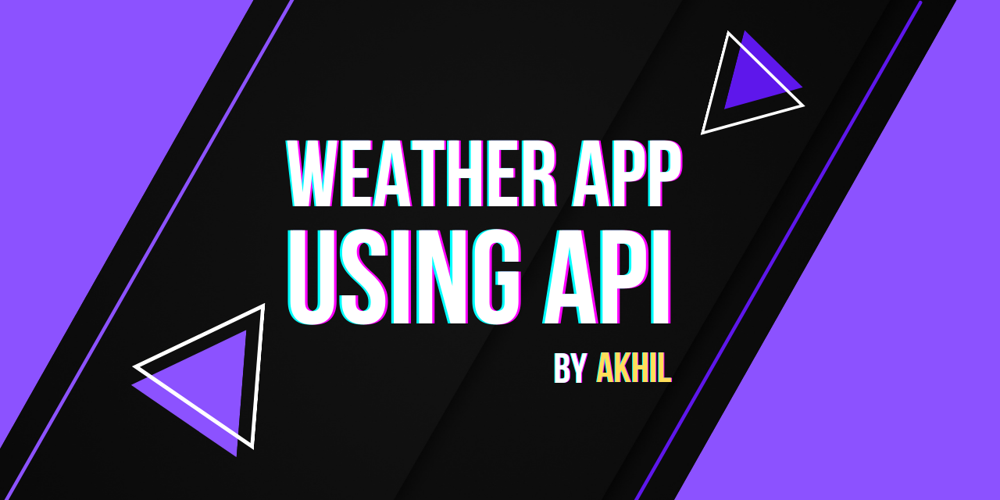

<h1 align="center">Weather App using API</h1>

<h3>A simple and elegant JS weather application built using Open Weather Map API. </h3>
Live Demo - <a href="https://weather.akhilkumar.ga/">here</a>
 
Note: Please allow Location Access to fetch your co-ordinates. Else, type your location manually!
